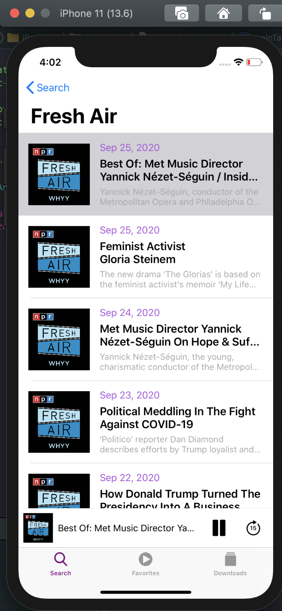

# iPodcast
## IOS Podcast application - iTunes

This is an IOS app that plays Podcasts from the iTunes library, bookmarking your favorite stations, and full support for audio playback, offline playback capabilities. 

## Core Features
- Alamofire Integration to greatly simplify network requests architecture
- AVKit Audio Player libraries for audio playback
- Offline Playback of podcasts enabled through download feature
- Control playback when App is in background
- Draggable Floating Player component accessible across all screens
- Search for Podcasts through iTunes API
- Parsing JSON asynchronously
- XML
- User Favorites persistence with UserDefaults

P.S application is still in progress
Kenroy Gayle - Callmewiz
Acknowledgments

Letsbuildthatapp